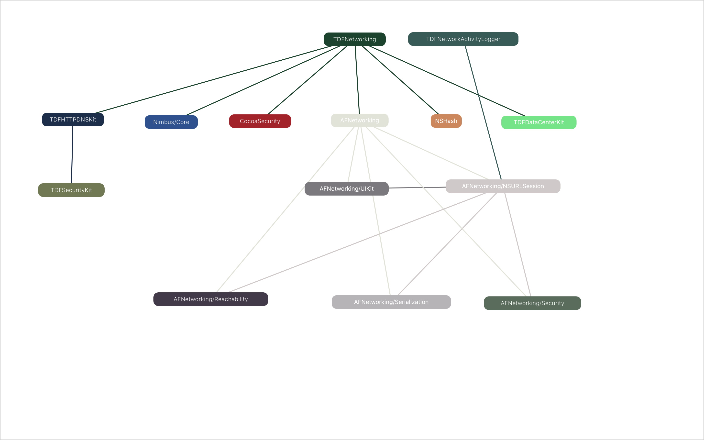
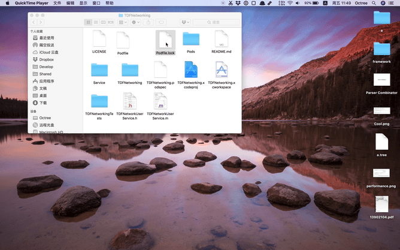
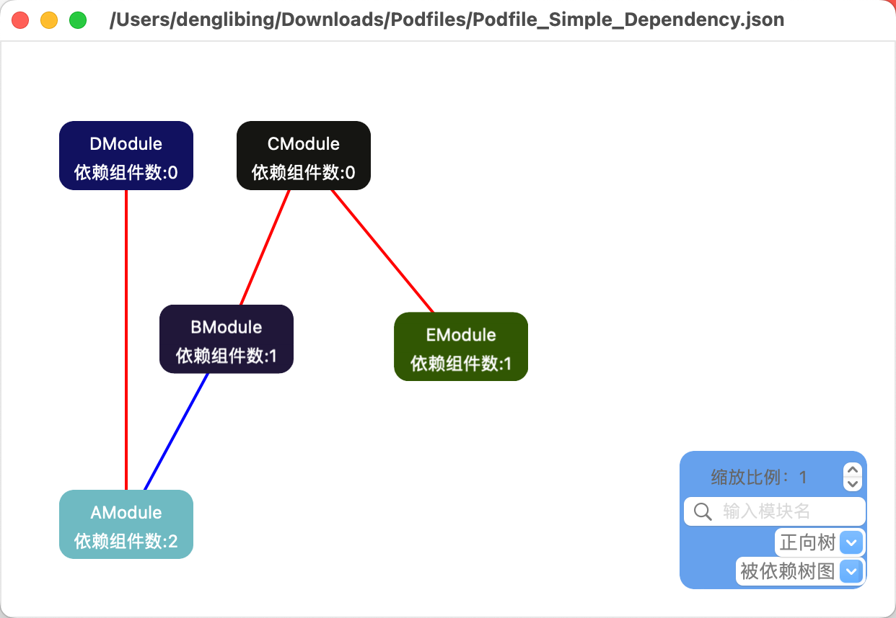
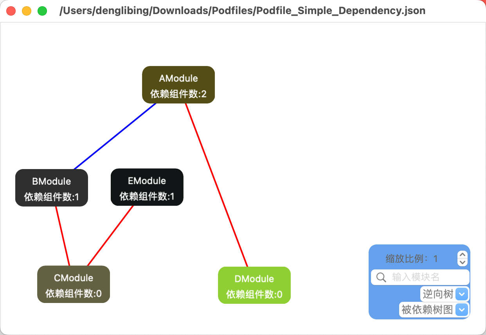
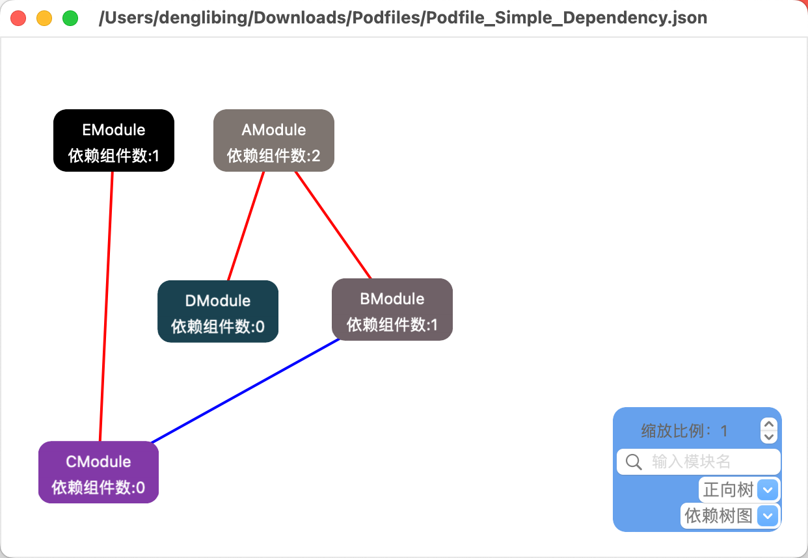
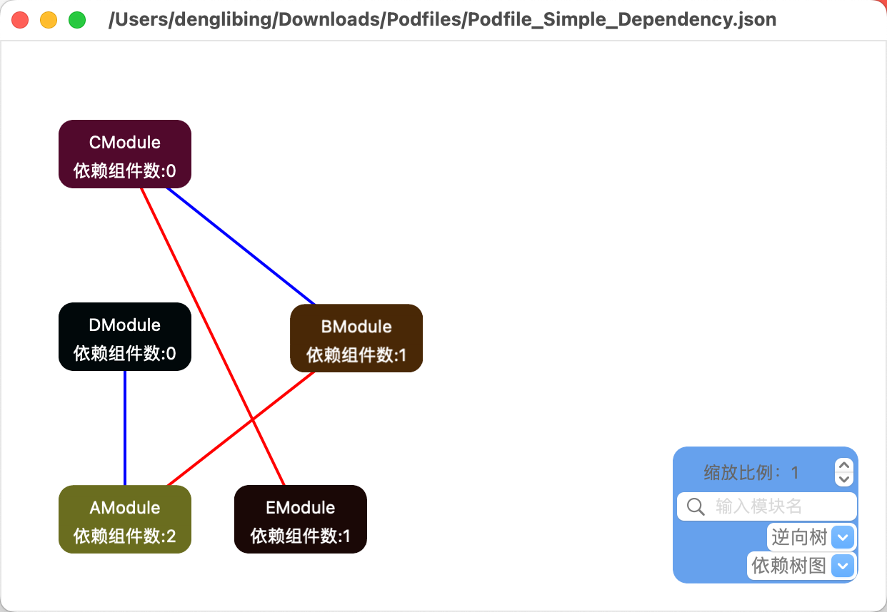

# Pretty

一个根据 Podfile.lock 生成依赖图的 Mac App。


> 和节点颜色相同的线连接子节点。


> 被拖拽的节点，红色连接子节点，蓝色连接父节点。

## Demo






## How To Use

> Dowload & Build

以如下数据为例说明：

```json
{
    "AModule":
    [
        "BModule",
        "DModule"
    ],
    "BModule":
    [
        "CModule"
    ],
    "EModule":
    [
        "CModule"
    ],
    "CModule":
    [],
    "DModule":
    []
}
```

`AModule` 依赖 `BModule、DModule`、 `BModule` 依赖 `CModule` 、`CModule、DModule` 没有依赖的模块

#### **1、`正向树&被依赖树图` 展示效果**



因为 `DModule`  是没有依赖的组件，在 `被依赖树图` 中，它应该和 `CModule` 是第一层中。


#### 2、`逆向树&被依赖树图` 展示效果



这里只是将 被依赖的模块，放在最下面。


#### 3、`正向树&依赖树图` 展示效果



这里是以 `依赖树AModule、EModule`  为视角进行层级排序，这里对于 `CModule` 来说还是最底层，但是 `DModule` 来说不再和 `CModule` 平级。


#### 4、`逆向树&依赖树图` 展示效果



这里只是将 依赖的模块，放在最下面。

场景使用：

|            | 正向树                                                       | 逆向树           |
| ---------- | ------------------------------------------------------------ | ---------------- |
| 被依赖树图 | 不依赖其他模块的模块作为根节点，并作为最上层的视图，依次排序，可以找到**依赖最深的模块**，即 AModule(三层)，而EModule（两层）则不是。 | 正向树层级的倒排 |
| 依赖树图   | 没有被其他模块依赖的模块为根节点，并作为最上层的视图依次排序，可以找到**被依赖最深的模块**，即CModule（三层），而DModule（两层）则不是 | 正向树层级的倒排 |


## TODO

- [x] 拖拽节点
- [x] 拖拽的节点高亮
- [x] 解析 Podfile.lock
- [x] 根据节点背景颜色，使用合适的字体颜色
- [x] 根据节点深度分组
- [x] 支持搜索组件功能-by harry
- [x] 支持点击只显示选中组件依赖树及数量 -by harry
- [x] 支持最深依赖树/被依赖树分组能力-by harry
- [x] 支持缩放能力 -by harry
- [ ] 学习 `macos` 开发
- [x] 保存依赖图文件(导出为 json格式) -by harry
- [x] 打开依赖图文件（json文件） -by harry

## License

Pretty is released under the MIT license. See LICENSE for details.% 
